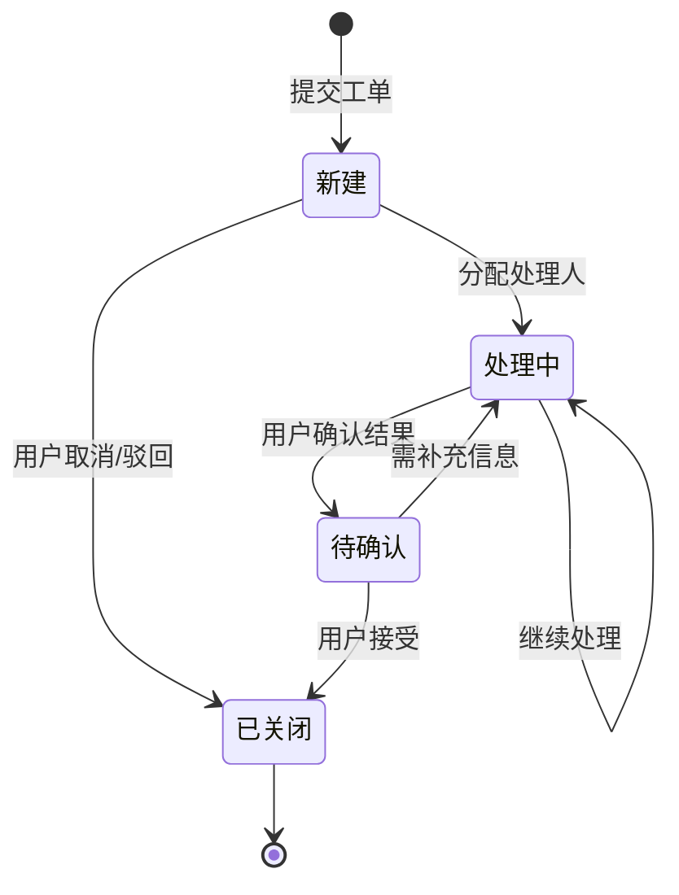
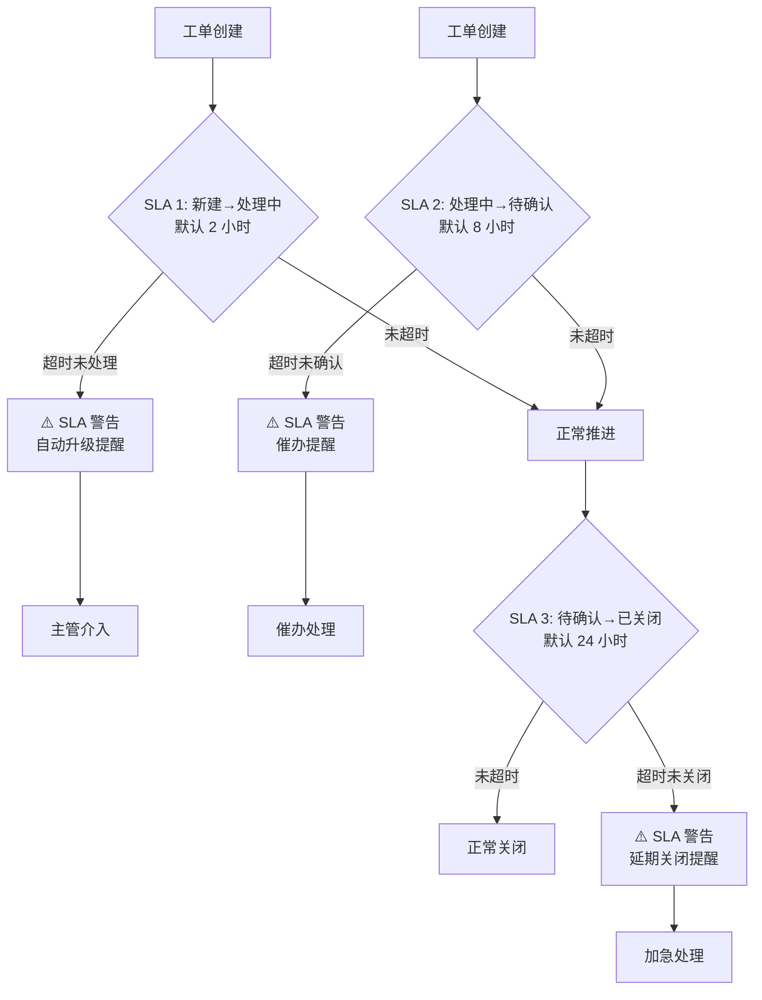

# 工单管理系统 - UX 设计方案 (最终版)

> 生成时间: 2026-02-25 23:55
> 设计师: ux-design Agent (GLM-4.7-flashx)
> 状态: ✅ 已完成

---

## 1. 页面线框图 (ASCII 原型)

### 1.1 工单列表页 (主界面)

```
┌─────────────────────────────────────────────────────────────────────────────────────────────┐
│ 工单管理系统                                        👤 张三   🔔 3  ⚙️        [新建工单] [查询] │
├─────────────────────────────────────────────────────────────────────────────────────────────┤
│                                                                                             │
│  ┌─────────────────────────────────────────────────────────────────────────────────────┐   │
│  │ 📊 仪表盘   📋 工单列表   📁 归档   ⚙️ 设置                                            │   │
│  └─────────────────────────────────────────────────────────────────────────────────────┘   │
│                                                                                             │
│  ┌─────────────────────────────────────────────────────────────────────────────────────┐   │
│  │ 状态筛选: [全部 ▼]   类型筛选: [全部 ▼]   优先级筛选: [全部 ▼]   搜索: [________________] [🔍] │   │
│  └─────────────────────────────────────────────────────────────────────────────────────┘   │
│                                                                                             │
│  ┌─────────────────────────────────────────────────────────────────────────────────────┐   │
│  │ 状态 | 编号   | 标题                     | 优先级 | SLA  | 负责人   | 操作               │   │
│  │─────────────────────────────────────────────────────────────────────────────────────│   │
│  │ 🟢 新建  | TG-20260225-001 | 客服系统无法登录   | 🔥 高  | 1h23m| 赵四     | [查看] [转交]      │   │
│  │ 🟡 处理中| TG-20260225-002 | 支付流程报错      | 🟡 中  | 5h47m| 钱五     | [查看]              │   │
│  │ 🔵 待确认| TG-20260225-003 | 订单退款异常      | 🔥 高  │ 12h  | 孙六     | [查看] [确认]      │   │
│  │ ⚫ 已关闭| TG-20260225-004 | 权限设置问题      | 🟢 低  │ 已超  | 周七     | [查看] [查看历史]   │   │
│  │ 🟢 新建  | TG-20260225-005 | 用户反馈找不到功能│ 🟡 中  │ 2h   | 吴八     | [查看] [转交]      │   │
│  └─────────────────────────────────────────────────────────────────────────────────────┘   │
│                                                                                             │
│  分页: [1] [2] [3] ... [12]  共 128 个工单                                                 │
└─────────────────────────────────────────────────────────────────────────────────────────────┘
```

### 1.2 工单详情页

```
┌─────────────────────────────────────────────────────────────────────────────────────────────┐
│ 工单详情                                      ← 返回列表     [编辑] [转交] [关闭]           │
├─────────────────────────────────────────────────────────────────────────────────────────────┤
│                                                                                             │
│  ┌─────────────────────────────────────────────────────────────────────────────────────┐   │
│  │ 标题: 客服系统无法登录                                     标签: 🔥 高优先级       │   │
│  │ 编号: TG-20260225-001   创建时间: 2026-02-25 23:50:12                               │   │
│  └─────────────────────────────────────────────────────────────────────────────────────┘   │
│                                                                                             │
│  ┌─────────────────────────────────────────────────────────────────────────────────────┐   │
│  │ 当前状态: 🟢 新建   负责人: 赵四   当前部门: 客服部                                  │   │
│  │ SLA 时效监控:                                                              │   │
│  │   新建→处理中: ⏱️ 1h 23m (剩余)     处理中→确认: ⏱️ —                 │   │
│  │   待确认→关闭: ⏱️ —                 已超时提醒: 0 个工单                │   │
│  └─────────────────────────────────────────────────────────────────────────────────────┘   │
│                                                                                             │
│  ┌─────────────────────────────────────────────────────────────────────────────────────┐   │
│  │ 📝 详细描述                                                                       │   │
│  │ 我登录客服系统时，提示"系统繁忙，请稍后再试"，但刷新后可以正常使用。希望能排查原因。│   │
│  └─────────────────────────────────────────────────────────────────────────────────────┘   │
│                                                                                             │
│  ┌─────────────────────────────────────────────────────────────────────────────────────┐   │
│  │ 📎 附件 (2)                                                                     │   │
│  │   [📄 错误截图.png]   [📊 日志文件.log]                                            │   │
│  └─────────────────────────────────────────────────────────────────────────────────────┘   │
│                                                                                             │
│  ┌─────────────────────────────────────────────────────────────────────────────────────┐   │
│  │ 📜 历史流转记录                                                                    │   │
│  │   2026-02-25 23:50:45 · 分配处理人: 赵四  [系统自动]                                 │   │
│  │   2026-02-25 23:50:12 · 创建工单: 客服系统无法登录  [系统自动]                        │   │
│  └─────────────────────────────────────────────────────────────────────────────────────┘   │
│                                                                                             │
│  ┌─────────────────────────────────────────────────────────────────────────────────────┐   │
│  │ 💬 评论 (3)                                                                      │   │
│  │   2026-02-25 23:55:00 · 张三: 负责人您好，系统目前还是无法登录，请尽快处理。         │   │
│  │   2026-02-25 23:58:30 · 赵四: 已收到，我正在排查数据库连接问题。                     │   │
│  │   2026-02-26 00:05:12 · 赵四: 已修复，请刷新页面重新登录。                         │   │
│  └─────────────────────────────────────────────────────────────────────────────────────┘   │
│                                                                                             │
│  [发表评论...]                                                                              │
└─────────────────────────────────────────────────────────────────────────────────────────────┘
```

---

## 2. 核心交互流程图 (Mermaid)

### 2.1 工单状态流转



### 2.2 SLA 时效监控流程



---

## 3. 组件设计规范

### 3.1 颜色系统 (Tailwind CSS)

| 组件 | 状态 | Tailwind 类 |
|------|------|------------|
| 状态标签-新建 | 🟢 绿色 | `bg-green-100 text-green-700` |
| 状态标签-处理中 | 🟡 橙色 | `bg-yellow-100 text-yellow-700` |
| 状态标签-待确认 | 🔵 蓝色 | `bg-blue-100 text-blue-700` |
| 状态标签-已关闭 | ⚫ 灰色 | `bg-gray-100 text-gray-500` |
| 优先级-高 | 🔥 红色 | `bg-red-50 text-red-600 border-red-200` |
| 优先级-中 | 🟡 橙色 | `bg-orange-50 text-orange-600 border-orange-200` |
| 优先级-低 | 🟢 绿色 | `bg-green-50 text-green-600 border-green-200` |

### 3.2 工单卡片组件

```html
<div class="bg-white border border-gray-200 rounded-lg p-4 hover:shadow-md transition-all">
  <div class="flex items-center justify-between mb-3">
    <div class="flex items-center gap-2">
      <span class="px-2 py-1 rounded text-sm font-medium bg-green-100 text-green-700">
        🟢 新建
      </span>
      <span class="text-xs text-gray-500">TG-20260225-001</span>
    </div>
    <span class="px-2 py-1 rounded text-xs font-medium bg-red-50 text-red-600 border border-red-200">
      🔥 高优先级
    </span>
  </div>
  
  <h3 class="text-base font-semibold text-gray-800 mb-2">
    客服系统无法登录
  </h3>
  
  <div class="flex items-center justify-between text-sm">
    <div class="flex items-center gap-4">
      <span class="text-gray-500">
        ⏱️ SLA 剩余: <span class="text-orange-600 font-semibold">1h 23m</span>
      </span>
      <span class="text-gray-500">
        👤 负责人: 赵四
      </span>
    </div>
    <button class="text-blue-600 hover:text-blue-800 font-medium">
      查看详情 →
    </button>
  </div>
</div>
```

---

## 4. 角色权限矩阵

| 角色 | 查看列表 | 查看详情 | 新建工单 | 转交工单 | 分配工单 | 更新状态 | 关闭工单 | 发起评论 | 上传附件 | 查看历史 |
|------|----------|----------|----------|----------|----------|----------|----------|----------|----------|----------|
| 提交者 | ✅ | ✅ | ✅ | ✅ | ❌ | ❌ | ❌ | ✅ | ✅ | ✅ |
| 处理者 | ✅ | ✅ | ❌ | ❌ | ✅ | ✅ | ❌ | ✅ | ✅ | ✅ |
| 主管 | ✅ | ✅ | ✅ | ✅ | ✅ | ✅ | ✅ | ✅ | ✅ | ✅ |
| 管理员 | ✅ | ✅ | ✅ | ✅ | ✅ | ✅ | ✅ | ✅ | ✅ | ✅ |

---

## 5. 响应式布局建议

### 5.1 PC 端 (> 1024px)
- 工单列表采用双栏布局：左侧筛选 + 右侧列表
- 详情页采用三栏布局：左侧导航 + 中间内容 + 右侧关联信息

### 5.2 平板端 (768px - 1024px)
- 单栏卡片式布局
- 状态标签横向排列

### 5.3 移动端 (< 768px)
- 单栏垂直滚动
- 关键信息优先展示
- 状态流转记录折叠式设计

---

## ✅ UX 设计完成

**设计方案已确认，可进入开发排期阶段。**
