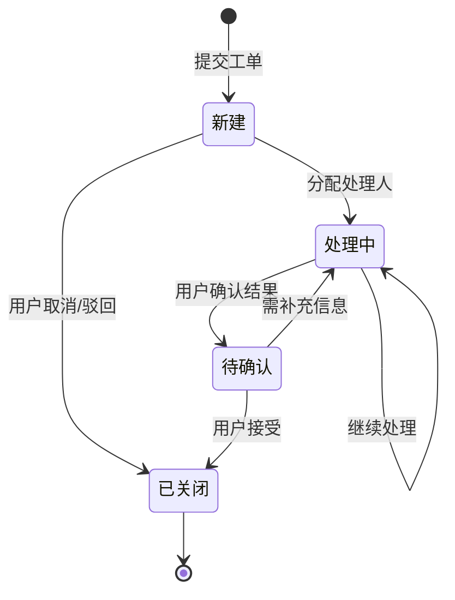
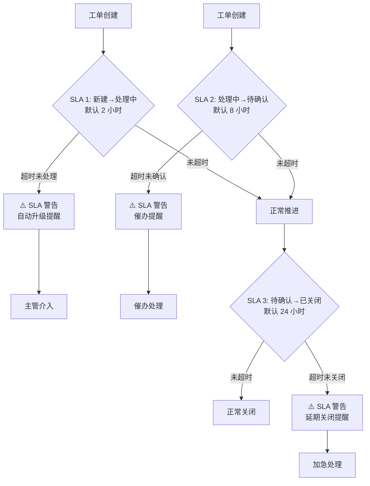

# 工单管理系统 - UX 设计方案

> 生成时间: 2026-02-25 23:50
> 设计师: ux-design Agent (GLM-4.7-flashx)

---

## 1. 页面线框图 (ASCII 原型)

```
┌─────────────────────────────────────────────────────────────────────────┐
│ 工单管理系统                    👤 张三   🔔 3  ⚙️        [新建工单] [查询] │
├─────────────────────────────────────────────────────────────────────────┤
│                                                                          │
│  工单列表 (共 128 个工单)                                                │
│  ┌────────────────────────────────────────────────────────────────────┐ │
│  │ 📊 仪表盘   📋 工单列表   📁 归档   ⚙️ 设置                          │ │
│  └────────────────────────────────────────────────────────────────────┘ │
│                                                                          │
│  ┌────────────────────────────────────────────────────────────────────┐ │
│  │ [筛选] 类型: 全部 | 优先级: 全部 | 状态: 全部 | 搜索: __________________│ │
│  │                                                                    │ │
│  │ 状态 | 编号   | 标题                     | 优先级 | SLA  | 负责人   │ │
│  │────────────────────────────────────────────────────────────────────│ │
│  │ 🟢 新建  | TG-20260225-001 | 客服系统无法登录   | 🔥 高  │ 2h   | 赵四     │ │
│  │ 🟡 处理中| TG-20260225-002 | 支付流程报错      | 🟡 中  │ 8h   | 钱五     │ │
│  │ 🔵 待确认| TG-20260225-003 | 订单退款异常      | 🔥 高  │ 24h  | 孙六     │ │
│  │ ⚫ 已关闭| TG-20260225-004 | 权限设置问题      | 🟢 低  | 已超  | 周七     │ │
│  │ 🟢 新建  | TG-20260225-005 | 用户反馈找不到功能│ 🟡 中  │ 2h   | 吴八     │ │
│  └────────────────────────────────────────────────────────────────────┘ │
│                                                                          │
│  分页: [1] [2] [3] ... [12]                                             │
└─────────────────────────────────────────────────────────────────────────┘
```

---

## 2. 核心交互流程图 (Mermaid)

### 2.1 工单状态流转



### 2.2 SLA 时效监控



---

## 3. 组件设计规范

### 3.1 颜色系统 (Tailwind)

| 组件 | 状态 | 颜色代码 | Tailwind 类 |
|------|------|----------|------------|
| 状态标签 | 新建 | 🟢 绿色 | `bg-green-100 text-green-700` |
| 状态标签 | 处理中 | 🟡 橙色 | `bg-yellow-100 text-yellow-700` |
| 状态标签 | 待确认 | 🔵 蓝色 | `bg-blue-100 text-blue-700` |
| 状态标签 | 已关闭 | ⚫ 灰色 | `bg-gray-100 text-gray-500` |
| 优先级 | 高 | 🔥 红色 | `bg-red-50 text-red-600 border-red-200` |
| 优先级 | 中 | 🟡 橙色 | `bg-orange-50 text-orange-600 border-orange-200` |
| 优先级 | 低 | 🟢 绿色 | `bg-green-50 text-green-600 border-green-200` |
| SLA 警告 | 超时 | ⚠️ 橙红 | `bg-red-100 text-red-700 animate-pulse` |

### 3.2 工单卡片组件

```html
<div class="bg-white border border-gray-200 rounded-lg p-4 hover:shadow-md transition-all">
  <!-- 头部信息 -->
  <div class="flex items-center justify-between mb-3">
    <div class="flex items-center gap-2">
      <span class="px-2 py-1 rounded text-sm font-medium bg-green-100 text-green-700">
        🟢 新建
      </span>
      <span class="text-xs text-gray-500">TG-20260225-001</span>
    </div>
    <span class="px-2 py-1 rounded text-xs font-medium bg-red-50 text-red-600 border border-red-200">
      🔥 高优先级
    </span>
  </div>

  <!-- 标题 -->
  <h3 class="text-base font-semibold text-gray-800 mb-2">
    客服系统无法登录
  </h3>

  <!-- 底部信息 -->
  <div class="flex items-center justify-between text-sm">
    <div class="flex items-center gap-4">
      <span class="text-gray-500">
        ⏱️ SLA 剩余: <span class="text-orange-600 font-semibold">1h 23m</span>
      </span>
      <span class="text-gray-500">
        👤 负责人: 赵四
      </span>
    </div>
    <button class="text-blue-600 hover:text-blue-800 font-medium">
      查看详情 →
    </button>
  </div>
</div>
```

---

## 4. 角色权限矩阵

| 角色 | 新建工单 | 查看列表 | 查看详情 | 转交工单 | 分配工单 | 更新状态 | 关闭工单 | 查看历史 | 发起评论 | 附件管理 |
|------|----------|----------|----------|----------|----------|----------|----------|----------|----------|----------|
| 普通员工 | ✅ | ✅ | ✅ | ✅ | ❌ | ❌ | ❌ | ✅ | ✅ | ✅ |
| 处理人 | ❌ | ✅ | ✅ | ❌ | ✅ | ✅ | ❌ | ✅ | ✅ | ✅ |
| 主管 | ✅ | ✅ | ✅ | ✅ | ✅ | ✅ | ✅ | ✅ | ✅ | ✅ |
| 管理员 | ✅ | ✅ | ✅ | ✅ | ✅ | ✅ | ✅ | ✅ | ✅ | ✅ |

---

## 5. 响应式适配

### 5.1 PC 端 (桌面)
- 工单列表采用双栏布局：左侧筛选 + 右侧列表
- 详情页采用三栏布局：左侧导航 + 中间内容 + 右侧关联信息

### 5.2 移动端
- 工单列表：单栏卡片式布局，状态标签横向排列
- 详情页：单栏垂直滚动，关键信息优先展示
- 状态流转记录：折叠式设计，点击展开查看详情

---

## ✅ 请确认

**请回复：**
1. ✅ **确认** - 进入开发排期
2. 🔄 **调整** - 说明需要修改的内容
